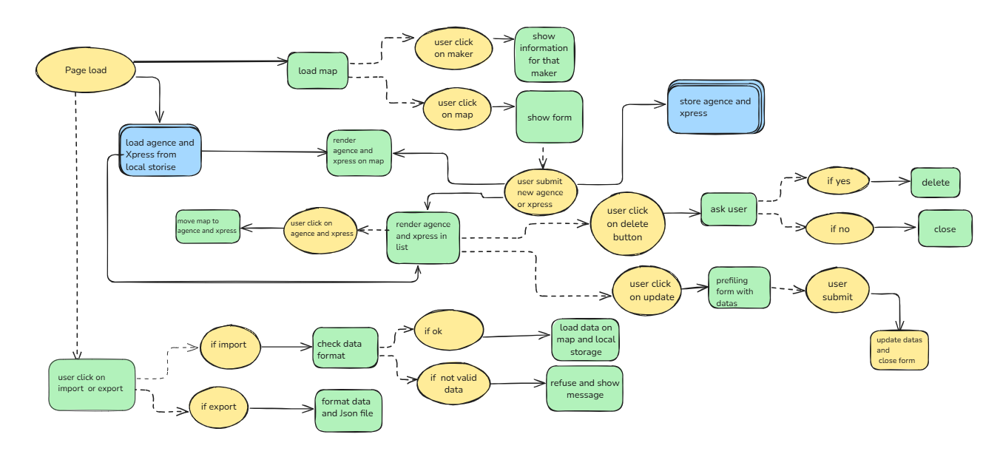
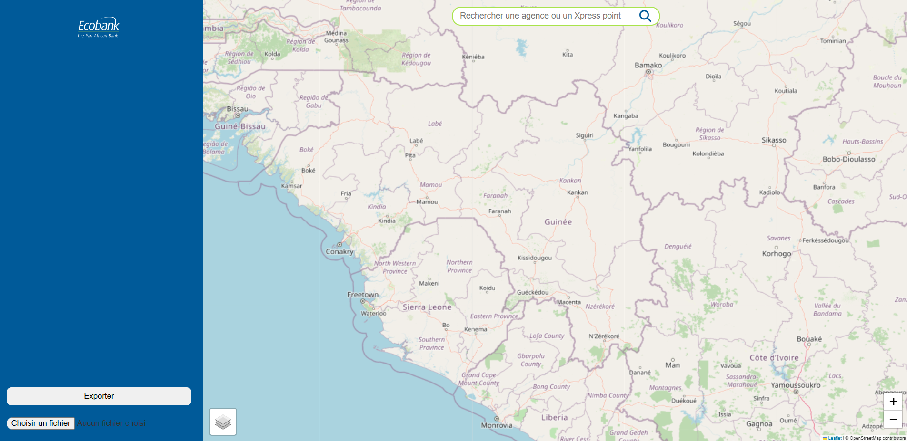
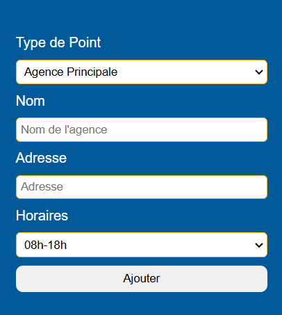
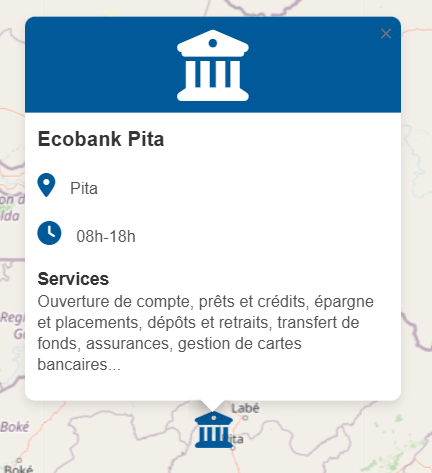
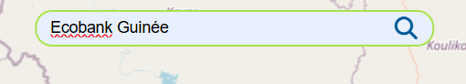
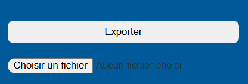
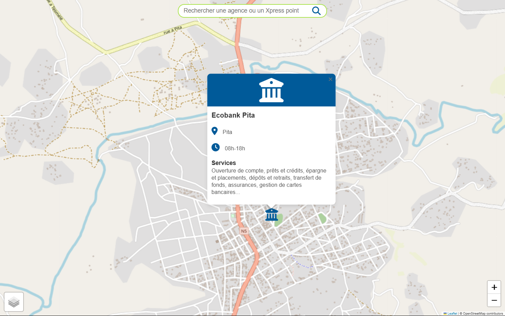
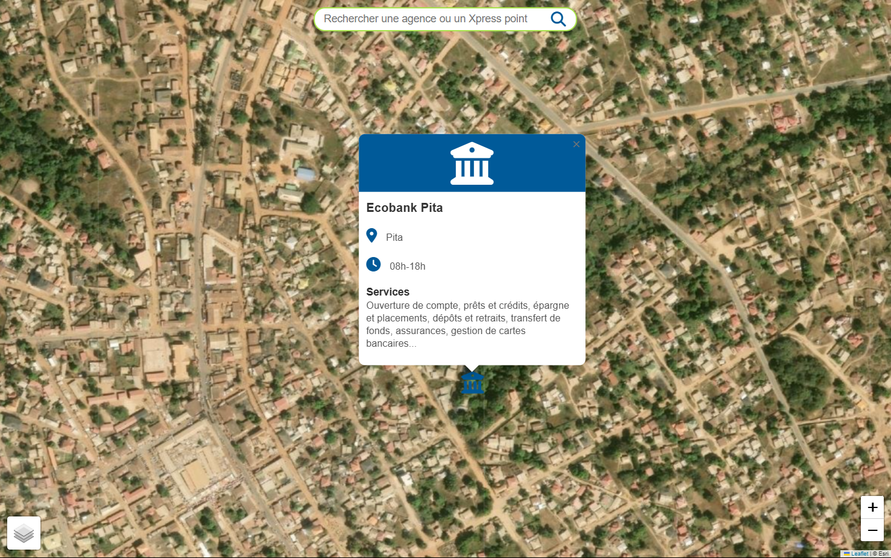

# MAP-ECO - Carte Interactive des Points Xpress et Agences Ecobank en Guinée 🏦🗺️

MAP-ECO est une application web permettant de gérer et visualiser les points bancaires à travers la Guinée, incluant agences et points de service Xpress. Elle propose une interface interactive avec import/export de données, des options de recherche et de visualisation pour une gestion intuitive.

## 📋 Table des Matières

- [Fonctionnalités](#fonctionnalités)
- [Spécifications Techniques](#spécifications-techniques)
- [Architecture](#architecture)
- [Flowchart](#flowchart)
- [Captures d'écran](#captures-décran)
- [Technologies Utilisées](#technologies-utilisées)
- [Utilisation](#utilisation)
- [Déploiement](#déploiement)
- [Contribution](#contribution)

## ✨ Fonctionnalités

- 🏦 **Gestion des Points Bancaires** : Ajout, modification, et suppression d’agences et points Xpress.
- 🔍 **Recherche** : Recherche par nom  de point bancaire (agence,  Xpress).
- 📍 **Géolocalisation sur la Carte** : Placement des points sur la carte avec affichage des détails.
- 📁 **Import/Export des Données** : Sauvegarde et restauration des données en JSON.
- ✅ **Interface Interactive et Responsive** : Optimisée pour desktop et mobile.
- 🎨 **Types de Vue sur la Carte** : Vue classique ou satellite.
- ✅ **Affichage Dynamique des Messages** : Boîtes de succès et d’erreur après chaque action.

## 🔧 Spécifications Techniques

- **Front-end** : Utilisation de HTML5, CSS3, et JavaScript pour une expérience utilisateur riche et interactive.
- **Stockage Local** : Utilisation de LocalStorage pour persister les données entre les sessions.
- **Interactions Cartographiques** : Leaflet.js pour afficher et manipuler la carte.
- **Gestion Dynamique** : Ajout, modification, suppression et recherche de points bancaires en temps réel.

## 🏛️ Architecture

- **Modèle MVC simplifié** : 
    - **Modèle** : Stockage et manipulation des données des points bancaires.
    - **Vue** : Mise en page et affichage des points bancaires et de leurs détails.
    - **Contrôleur** : Gestion des interactions de l'utilisateur et mise à jour de la vue.

- **Interactions avec la carte** : Leaflet.js pour l'affichage et les interactions géographiques.
- **LocalStorage** : Stockage des points bancaires pour la persistance des données.

## 📈 Flowchart

Un diagramme simplifié du flux utilisateur est le suivant :

1. **Ouverture de la Carte** 
2. **Sélection d’un Point ou Clic sur la Carte** : 
    - Affichage du formulaire d'ajout/modification
3. **Enregistrement du Point** : Ajout sur la carte et sauvegarde dans LocalStorage
4. **Recherche** : Recherche dynamique des points
5. **Affichage de Résultats** : Résultats affichés et navigables
6. **Import/Export** : Actions de sauvegarde et de récupération des données

## 📸 Captures d'écran

### Page d'Accueil

### Ajout d'un Point Bancaire

### Détails  d'un Point

### Recherche

### Import et Export de Données

### Vue de la Carte

## 🛠️ Technologies Utilisées

- **HTML5 / CSS3** : Base de la structure et de la présentation de l'application.
- **JavaScript (ES6+)** : Fonctionnalités interactives de l'application.
- **Leaflet.js** : Bibliothèque de cartographie pour l'affichage et la gestion de la carte interactive.
- **LocalStorage** : Persistance des données utilisateur.

## 🚀 Utilisation
- **Ajout de Point** : Cliquez sur la carte, remplissez le formulaire, et enregistrez.
- **Recherche**  : Utilisez la barre latérale pour rechercher ou filtrer.
- **Modification/Suppression** : Accédez aux détails du point pour modifier ou supprimer.
- **Import/Export** de Données : Importez ou exportez les points en format JSON.
## 🌐 Déploiement
L'application est déployée en ligne pour une utilisation facile. Visitez : 
- [Github](https://github.com/AlphaOumarDiall0/Projet-MapEco)
- [Vercel](https://map-eco.vercel.app)

## 👥 Contribution
Les contributions pour améliorer MAP-ECO sont bienvenues ! 

- **Pour contribuer** :

- Forkez le projet
- Créez une branche pour votre fonctionnalité (git checkout -b featureName)
- Committez vos changements (git commit -m 'Ajout d'une fonctionnalité')
- Pushez vers la branche (git push origin featureName)
- Ouvrez une Pull Request